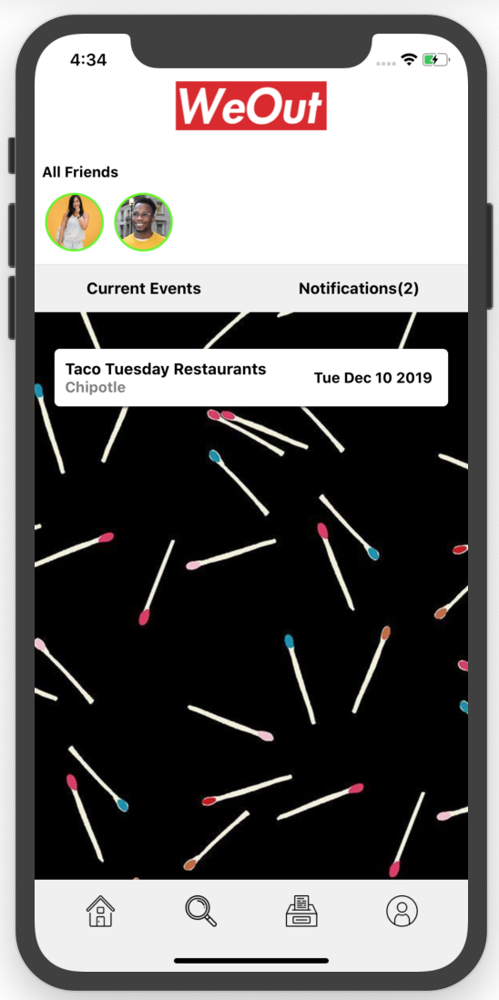
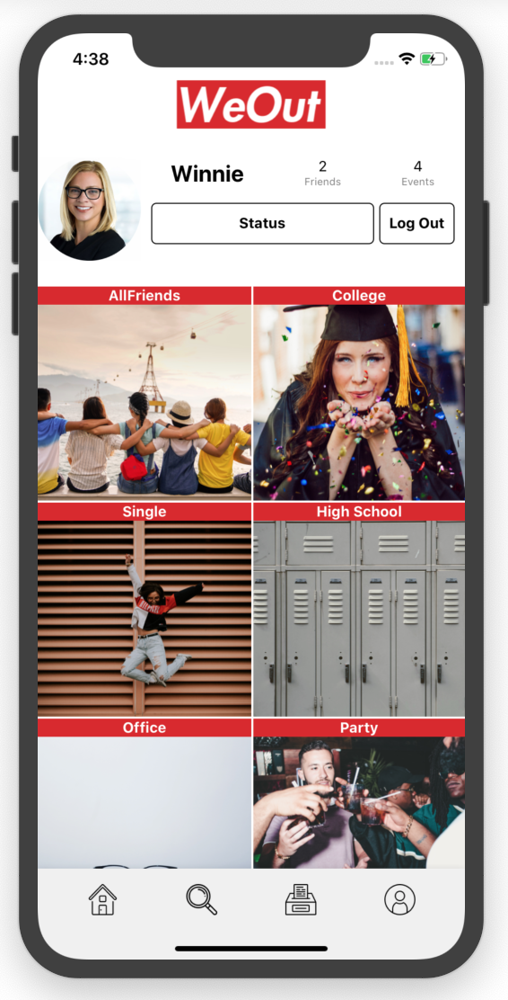

# WeOut

Welcome to WeOut(beta): An easy-to-use mobile application allowing users to efficiently and quickly coordinate events with your friends. Users can categorize their friends into groups, and invite them into a customizable poll room.

## Getting Started

### Requirements

Must have xCode installed and node.js or yarn.

### How To Install

Please fork and clone.

```
git clone https://github.com/NewYorkersUnite/WeOut.git
```

After installing, run:

```
npm run ios
npm start
```

This starts the iPhone simulator and starts the bundle.js

## Features

| Dashboard                          |               Search               | Profile |
| ---------------------------------- | :--------------------------------: | :-----: |
|  |  |
|        |

### Dashboard

Upon logging or signing into the app, you will be brought to your dashboard:

On this page, the user will see all their available friends appear on the top of the page. The dashboard will also be the place where you will see any pending notifications and any upcoming events.

### Search

If the user would like to add a friend, the moment the inputted characters that match to a username in the database, the filtered out users will appear on the screen with the option to add them. If selected to be added, a friend request is sent to the recipient and it will render on their notifications tab on their dashboard.

### Profile

The user can see their profile page which will have the total amount of friends that they have and how many events they’ve been involved in. On this page, if a user is not available, they can simply press the `Status` button which will toggle their status from active to inactive (and visa versa). The bottom of the profile page shows all the categories that the user may have organized their friends into.

When adding a friend, they can specify a category (or multiple categories) that they may fall into. If the user pressed on a particular category, they would be able to see all the friends that fall in that category, and at the bottom of the screen, the user has the option to invite some or all into an event using a poll.



Once the invite button has been pressed, the user will be brought to a form where they can input the event details and set limits for the amount of suggestions allowed and how long the invited participants will have to give an answer and/or add a suggestion. After submitting the details, they will be brought to all the open polls, including the newly made one.


### Active Polls
