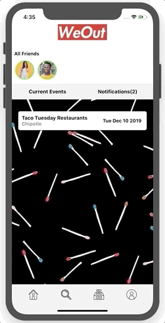
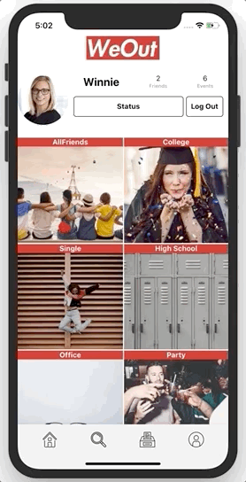

<p align="center">
  
</p>

# WeOut

Welcome to WeOut(beta): An easy-to-use mobile application allowing users to efficiently and quickly coordinate events with your friends. Users can categorize their friends into groups, and invite them into a customizable poll room.

## Getting Started

### Requirements

Must have xCode installed and node.js or yarn.

### How To Install

Please fork and clone.

```
git clone https://github.com/NewYorkersUnite/WeOut.git
```

After installing, run:

```
npm run ios
npm start
```

This starts the iPhone simulator and starts the bundle.js

## Presentation

You can view our presentation here:
https://www.youtube.com/watch?v=yPo5WqBascQ&list=PLx0iOsdUOUmnTCO5wLzNNeaLbbZLlngp6&index=18&t=0s

## Features

| Dashboard                          |               Search               |
| ---------------------------------- | :--------------------------------: |
|  |  |

### Dashboard

Upon logging or signing into the app, the user will be brought to their dashboard.

On this page, the user will see all of their available friends appear on the top of the page. The dashboard will also be the place where the user will see any pending notifications and any upcoming events.

### Search

If the user would like to add a friend, they can utilize the search bar to search for another user. Under the search bar, the user will appear along with the option to add them. Once added, a friend request is sent to the recipient and will render on their notifications tab on their dashboard.

| Status                          |             Categories              |
| ------------------------------- | :---------------------------------: |
|  |  |

### Profile

Status:
The user can see their profile page which include their total amount of friends and how many events they’ve been involved in. On this page, the user can toggle their availability by simply pressing the `Status` button. The bottom of the profile page shows all the categories that the user may have organized their friends into.

Categories:
When adding a friend, they can specify a category (or multiple categories) that they may fall into. If the user pressed on a particular category, they would be able to see all the friends of that category. At the bottom of the screen, the user has the option to invite some or all friends into a "poll room".

| Invitation to Poll Room              |             All Polls             |
| ------------------------------------ | :-------------------------------: |
|  |  |

### Polls

Invitation into Poll Room:
Once the invite button has been pressed, the user will be brought to a form where they can input the event details. They will be able to set a limit for the amount of suggestions and how long the invited participants will have to add a suggestion and/or vote. After submitting the details, they will be able to view all the active polls, including the newly made one.

All Polls:
On this page, the user can see all the active polls with a preset timer. Once the timer is up, the poll will be removed from this screen and the results will be displayed on the dashboard (date & time, title of event, and winning vote).

Poll Room:
The user can also click on a specific poll. They'll be taken to the poll room where they can view all suggestions, add their suggestion, and submit their vote.

## Common Issues

React native is a relatively new framework and often times, the libraries might be depreciated or a new version may have been released. If this happens, please run:

```
npm install
```

## Resources

Built on React Native, Firebase, and Node.

## Creators

Vanessa Chan, Nayyif Oussamatou, Kaitlyn Martinez
